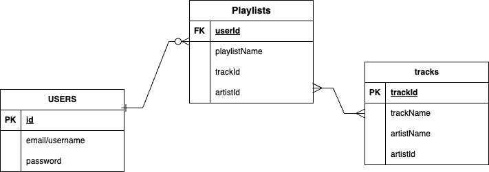
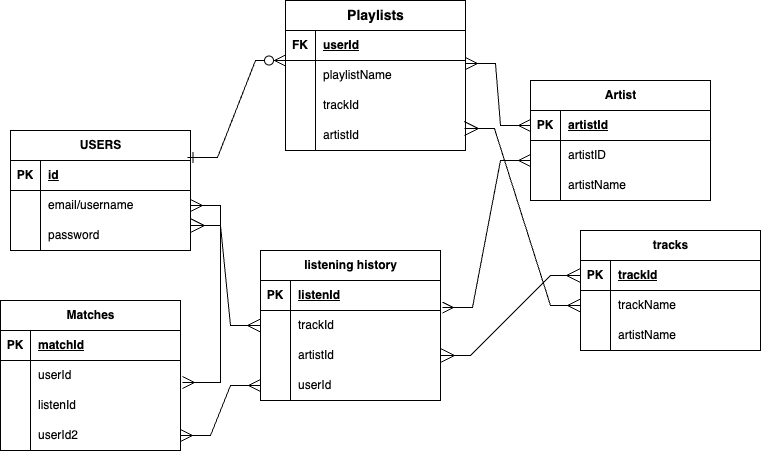
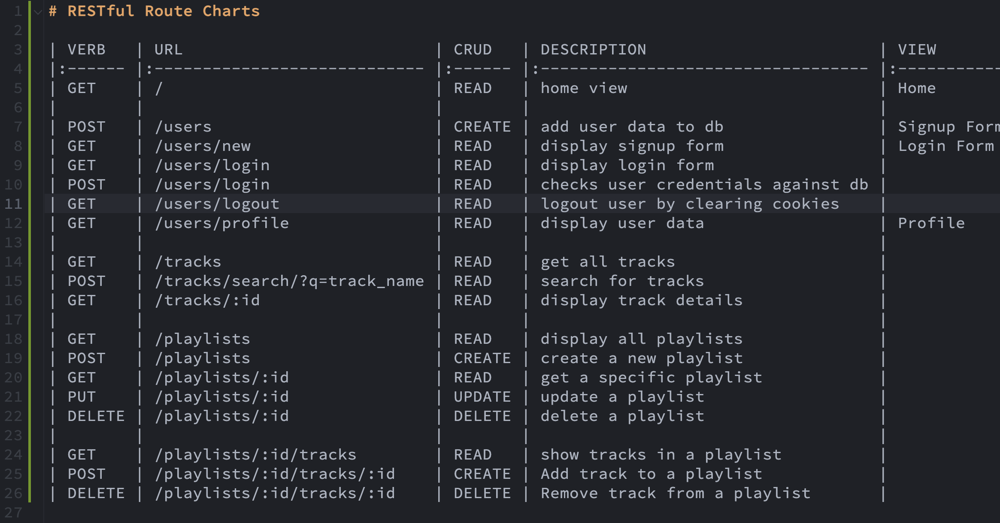

Users will be able to access a database of music through last.fm and be able to search through a list of tracks. You can add music of your choice to a playlist. You can also be matched to users who have similar music taste as you and be able to connect with them.

API Chosen
last.fm API 
API Example

MVP ERD
_______________________

Stretch ERD
_______________________

RESTful Routing Chart

Wireframes
    WIP

Approach Taken
Started with a route and view folder for the home page and made sure I had all dependencies I would need installed. Then I built a views folder for each page I would need, which I then added route outlines. At first I tried to get a lot of things done at once rather than breaking it down into smaller portions to tackle. But I realized I should be working on one thing at a time and focusing on that specific piece of the code's back-end and front-end functionality(for example making a button render results/ take you to another page or allowing users input to be put into the database) 

Technologies Used
- Node.js
    - Express, ejs, dotenv
    - Sequelize, sequelize-cli
    - Postgres
    - crypto-js
- Last.fm API

User Stories
- As a user I want to be able to create playlists of my favorite tracks so I can have a place saved with music specific to me.
- As a user I want to be able to search different tracks and add them to a favorites/playlists.
- As a user I want to be able to edit the name of already exisiting playlists.
- As a user I want to be recommended music based off of my listening history so I can explore new music similar to my taste
- As a user I want to be matched to other users who have similar istening history and connect to them.

Installation Instructions
- Fork and clone this repo
- Open project directory and install all dependencies: npm i 
- touch .env file and add API_KEY = "your api key" and ENC_KEY="your secret key" 
- Run 'sequelize db:create' to create data tables then run then 'sequelize db:migrate' 
- Run nodemon in terminal and open browser to server app is running on

MVP Goals
- User can sign in or create an account with secure authentication
- User can search through music
- User can add tracks of their choice to a playlist
- Have a route to each page: login, user/profile, playlist/favorites, search
- have tables and databses for users and extract data from API that is needed

Stretch Goals
- Have a music player in app
- Customize user profile
- Connect with other users through messaging or follows
- You will be able to recieve music recommendations based off of your listening history
- Have a route for matches and listening history
- Be matched to others who have similar playlists, listening history, or music recommendations

Post-Project Reflection
Need to work on bugs and add styling, hopefuly more functionality as well. Future plans for project include completing all stretch goals. There is improvement that can be done in all areas, I was only able to get the most basics of the app done. I am still getting familiar with how routes create functionality in the back-end, I hope it can come naturally once i take this project further.